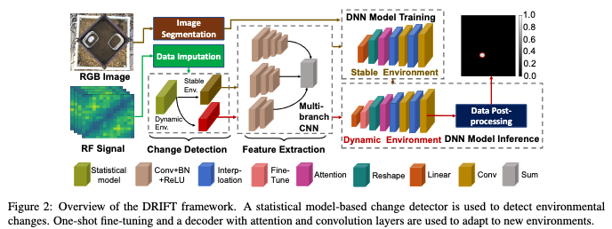
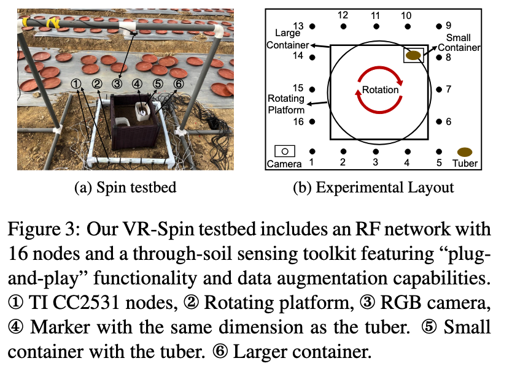

# DRIFT

We introduce DRIFT, a novel data-driven framework for radio frequency (RF) tomography. The DRIFT framework comprises a cross-model sensing with RF and visual sensors, and incorporates a deep neural network (DNN) for RF sensing trained using a cross-model learning approach. In addition, the framework integrates an environmental change detector and a one-shot fine-tuning module to enable robust tomographic imaging of underground tubers in dynamic environments. 

<p align="center">
  
</p>

For data acquisition, we design a testbed named VR-Spin, a cross-modal sensing system equipped with RF and visual sensors. Containers of different sizes are used to hold the soil and tubers and can be easily replaced, thereby accelerating the data collection process.

<p align="center">
  
</p>

To assess the performance of the DRIFT framework, we construct a dataset in a dynamic environment and conduct extensive evaluations on it. We have released a portion of the pre-trained models and the corresponding data files in releases, which can be used for performance evaluation.

# Prerequisite and Evaluation
## Prerequisite
DRIFT is implemented with Python 3.10 and PyTorch 2.1.0. We manage the development environment using Conda. Execute the following commands to configure the development environment.
* Create a conda environment called DRIFT based on Python 3.10, and activate the environment.
```
conda create -n DRIFT python=3.10
conda activate DRIFT 
```
Install PyTorch, as well as other required packages, 
```
  pip3 install torch
  pip3 install scikit-learn==1.0.2
  pip3 install scikit-image==0.19.2
```
Download or git clone the DRIFT project. Download and unzip  Model.zip and GroundTruth.zip in releases to the project directory. 
```
   unzip Model.zip -d [DRIFT root directory]
```

